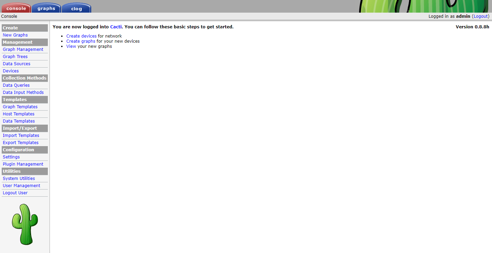
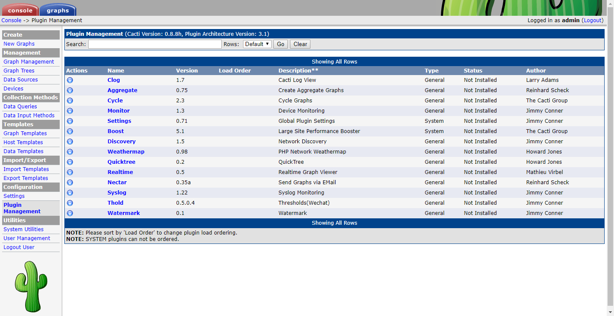
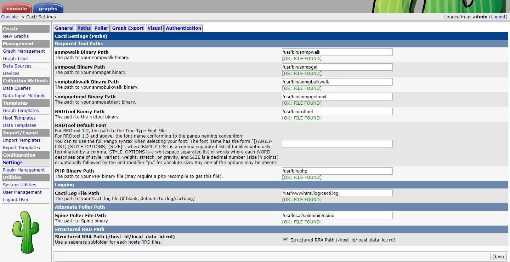

# Cacti 0.8.8h Docker Container
---
 
[](https://microbadger.com/images/babyfenei/cacti-0.8.8h "Get your own image badge on microbadger.com")  [](https://microbadger.com/images/babyfenei/cacti-0.8.8h "Get your own version badge on microbadger.com")  [](https://microbadger.com/images/babyfenei/cacti-0.8.8h "Get your own license badge on microbadger.com")

##### Github Repo: https://github.com/babyfenei/docker-cacti
##### Dockerhub Repo: https://hub.docker.com/r/babyfenei/cacti-0.8.8h/
---
[README](README.md) | [中文文档](README_ZH.md)

---

## 特征
1. 此docker基于centos 6.8版本，已将cacti-0.8.8h，rrdtool-1.4.9，spine-0.8.8h
   
2. 自动将中文Microsoft Yahoo字体添加到centos系统，默认情况下rrdtool和cacti均支持中文
   
3. 可自定义的rrdtool水印变量，可以在变量RRDTOOL_LOGO中进行修改
   
4. 自动添加图形导出脚本，以每天和每天根据日期自动导出图形树中的所有图形和数据。导出数据保存在/var/www/export目录中
   
5. 自动添加数据备份脚本，备份数据保存在/var/www/backup目录中,备份文件自动删除3天前的备份文件以节约空间
   
6. 在cacti-0.8.8h下添加了插件的一部分，包括Realtime, Clog, Syslog, Monitor, Nectar, Thold, Watermark, Settings, Cycle等
 
8. 更改了graph_xport.php文件的编码，以解决中文标题图形导出数据的乱码问题
   
9.  修复了一些常用设置，如默认勾选 Structured RRA Path
    
10. 修改Base_value的值（1000或1024），可以将base_value中设置诸如1024反馈到图形中
    
11. Thold插件集成了企业微信报警功能，您只需在设置中设置相关的ID和密码即可使用。具体设置方法请自行查询
    
12. 修复时间戳错误，时间戳大于或等于1600000000不能缩放graph和graph_export

13. 修改默认RRAs策略，可实现5分钟流量数据保存1年


---

## 如何使用此容器
### 使用docker-compose
```
 wget --no-check-certificate  https://raw.githubusercontent.com/babyfenei/docker-cacti/master/docker-compose.yml &&  docker-compose up -d
```


### 运行容器
此docker容器基于cacti0.8.8h。默认情况下，它没有数据库。您必须使用外部mysql数据库或mysql数据库docker容器。我在测试环境中使用的数据库docker映像为million12 / mariadb，但是此数据库映像无法修改时区。您还可以使用其他mysql映像，最好可以修改时区。

### 端口设置
需要在构建容器时暴露一下端口

| Port |     Notes     |  
|------|:-------------:|
|  80  | HTTP 端口      |
|  514 | SYSLOG   端口  |


### 部署数据库
首选我们需要构建一个数据库容器，我们已经测试了 [million12/mariadb](https://registry.hub.docker.com/u/million12/mariadb/) 数据库容器可以正常使用。

**需要了解更多关于 million12/MariaDB 容器的信息可参考[documentation.](https://github.com/million12/docker-mariadb) **

mysql容器:  
```
    docker run \
    -d \
    --name cacti-db \
    -p 3306:3306 \
    --env="MARIADB_USER=cactiuser" \
    --env="MARIADB_PASS=my_password" \
    million12/mariadb
```
***在部署cacti容器时，请记住使用相同的凭据.***

### Mysql环境变量
可使用以下环境变量来运行mysql容器.

| Variable|Description|
|:------:|:-----|
|MARIADB_USER|database user|  
|MARIADB_PASS|database password|  
|TIMEZONE|timezone  |

### 部署Cacti
当数据库容器部署成功后，可使用以下命令运行cacti容器

cacti容器:  
```
    docker run \
    -d \
    --name cacti \
    -p 80:80 \
    -p 514:514 \
    --env="DB_HOST=localhost" \
    --env="DB_PORT=3306 \
    --env="DB_USER=cactiuser" \
    --env="DB_PASSWORD=cactiuser" \
    --env="TIMEZONE=Asia/Shanghai" \
    --env="RRDTOOL_LOGO=CACTI0.8.8h/RRDTOOL1.4.9-BY:Fenei" \
    --env="INITIALIZE_DB=0" \
    -v '/data/cacti/html':'/var/www/html':'rw' \
    -v '/data/cacti/backups':'/var/www/backups':'rw' \
    -v '/data/cacti/export':'/var/www/export':'rw' \
    babyfenei/cacti-0.8.8h
```

### cacti 环境变量
运行此cacti容器时必须指定可访问的mysql数据库的环境变量，并可指定时区及rrdtool的logo水印文字

| Variable|Default|Description|
|:------:|:----:|:-----|
|DB_HOST|localhost|远程数据库连接地址，使用IP或域名|
|DB_PORT|3306|远程数据库连接端口|
|DB_USER|cactiuser|远程数据库用户名|
|DB_PASSWORD|cactiuser|远程数据库密码|
|TIMEZONE|Asia/Shanghai|Cacti服务器时区，可在/usr/share/zoneinfo中查看|
|RRDTOOL_LOGO|DOCKER-CACTI0.8.8h/RRDTOOL1.4.9-BY:Fenei|Rrdtool右侧LOGO，您可以修改cacti图形右侧的水印，请注意不要输入符号#|
|INITIALIZE_DB|0|初始化数据库开关，1是初始化，0不是，默认为0。仅在检测到仙人掌数据库时有效|


### 目录: 挂载目录说明
|File directory| description|
|:---:|---|
|/var/www/html | cacti主文件|
|/var/www/backups| cacti 备份文件，每日备份，3天以上的备份自动清空|
|/var/www/export | cacti 图形数据导出文件，自动导出图形树中的所有图形，包括图形和原始数据。每日凌晨自动导出前一天整天的图形和数据，每月1号自动导出上月整月的图形和数据。您也可以在图形名称后使用英文()，在括号中定义每月流量导出日期|

### 访问Cacti Web界面
首次登录仙人掌，请使用凭据admin:admin。在首次登录时，系统会要求您更改默认密码

### Notice
1. 如果实时图形(realtime)中有图形和数据，但是图形列表中没有数据，请select * from cacti.poller_time;在mysql数据库中使用查询轮询时间。如果时间与仙人掌服务器时间不匹配，则需要修改mysql数据库服务器。时间或使用set time_zone = '${mysql_zone}';修改数据库时间
2. 如清空rrd文件夹，可使用 php /var/www/html/poller.php --force 强制查询所有图形
3. 如果宿主内存小于1G，数据库容器可能无法正常运行，需使用以下命令创建swap分区后再次创建数据库容器
    ```
    dd if=/dev/zero of=/swapfile bs=1M count=1024
    mkswap /swapfile
    swapon /swapfile
    ```

### 




